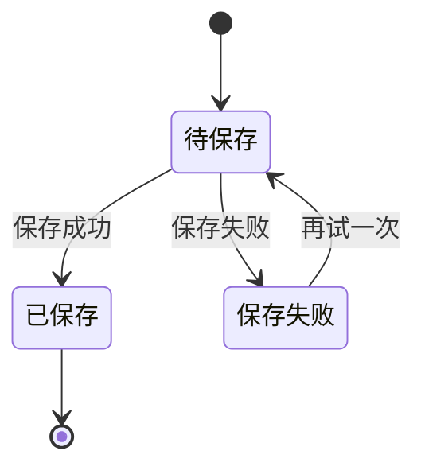

# 产品需求文档：不失（MVP）- V0.2

## 1. 综述 (Overview)
### 1.1 项目背景与核心问题
这是一个只服务“我自己”的私密空间，目标不是记录更多，而是让“当时那个版本的我”被留住，并在未来被温柔唤起。核心问题是：洞察与情绪出现得太快、记录成本太高、现有工具让真实消失；而在需要回顾时又一片空白。MVP 要解决的是“在任何状态下都能留下真实自己，并在合适时刻被温柔唤起”。

### 1.2 本版本新增/更新要点
1. **AI 入口与对话**：顶部新增“和 AI 聊聊”入口，支持一问一答、消息滚动、回车发送。
2. **文件上传与多模态预览**：记录支持图片/视频上传，记录卡片内可点击预览，下载触发浏览器下载。
3. **轻量自我观察（AI 生成）**：由智能体生成一句提示与相关记录列表，点击提示弹出详情。
4. **粗时间视角调整**：时间段改为最近 3 天 / 最近 10 天 / 最近 30 天，并显示真实条数。
5. **这些时刻分页**：列表分页，每页最多 6 条，最近在第一页，避免页面失衡。

### 1.3 Mermaid 图（流程/状态/时序）
#### 1.3.1 用户操作流
```mermaid
flowchart TD
  A[打开私密空间] --> B[进入记录输入区]
  B --> C[立即放下内容<br/>文字/图片/视频/情绪标签(可空)]
  C --> D[保存]
  D --> E[记录加入“这些时刻”]
  E --> F[可复制/下载/删除]
  E --> G[点击媒体预览]
  B --> H[右侧“被动回顾”]
  B --> I[粗时间视角：3/10/30天]
  B --> J[轻量自我观察提示]
  J --> K[弹窗展示相关记录]
  B --> L[AI 入口对话]
```

#### 1.3.2 状态机（记录保存）


## 2. 用户故事详述 (User Stories)

### 阶段一：进入与放下
---
#### **US-01: 作为我，我希望能立刻放下一个“当下切片”，以便于不丢失瞬间洞察**
* **价值陈述 (Value Statement)**:
  * **作为** 自用用户
  * **我希望** 打开即能记录，不必整理
  * **以便于** 抓住稍纵即逝的真实
* **业务规则与逻辑 (Business Logic)**:
  1. **前置条件**：用户进入记录输入区。
  2. **操作流程**：
     - 用户输入文字/添加图片或视频/选择情绪标签（最多一个、可空）。
     - 点击“保存这一刻”。
     - 系统保存成功，输入区清空，停留在输入区。
     - 新记录立即出现在“这些时刻”列表顶部。
  3. **异常处理**：
     - 当记录内容为空（无文字、无媒体、无情绪标签）时，不允许保存，提示：“先留下一点点，再继续也可以。”
     - 保存失败时提示：“这条暂时没留住，我们等一下再试。”
* **验收标准 (Acceptance Criteria)**:
  * **GIVEN** 用户输入至少一种内容
  * **WHEN** 点击保存
  * **THEN** 保存成功并清空输入，记录出现在列表顶部

---
#### **US-02: 作为我，我希望图片/视频能被预览与下载，以便于留住当时的视觉**
* **业务规则与逻辑**：
  1. 记录卡片内图片/视频缩略图可点击预览。
  2. 下载按钮应触发浏览器下载行为，不离开当前页面。
  3. 删除需二次确认。
* **验收标准**：
  * 点击缩略图可打开预览弹窗。
  * 点击下载触发下载，不刷新页面。
  * 删除时弹出确认框。

---
#### **US-03: 作为我，我希望“这些时刻”分页，以便于页面保持稳定**
* **业务规则与逻辑**：
  1. 每页最多 6 条记录。
  2. 最近记录在第一页。
  3. 切换页不影响搜索结果。
* **验收标准**：
  * 列表超过 6 条时出现分页控件。
  * 切换页面仅影响“这些时刻”列表。

### 阶段二：被动回顾
---
#### **US-04: 作为我，我希望被动看到一条过去的记录，以便于轻轻对齐自己**
* **业务规则与逻辑**：
  1. 右侧栏展示一条回顾内容，包含时间与情绪标签。
  2. 提供“再遇见一条”与“自动轮换”开关。
  3. 自动轮换每 30 秒切换一条。
* **验收标准**：
  * 有记录时显示回顾卡片。
  * 开启自动轮换后 30 秒自动切换。

### 阶段三：时间视角与轻量对齐
---
#### **US-05: 作为我，我希望看到粗时间视角，以便于感知变化**
* **业务规则与逻辑**：
  1. 固定时间段：最近 3 天 / 最近 10 天 / 最近 30 天。
  2. 每个时间段显示真实记录数量。
  3. 点击时间段进入对应检索结果展示。
* **验收标准**：
  * 三个时间段入口正确展示并可点击。
  * 进入后显示相应记录列表。

---
#### **US-06: 作为我，我希望系统生成轻量观察提示与相关记录，以便于对齐最近状态**
* **业务规则与逻辑**：
  1. 智能体输入：最近 30 天内且最多 15 条记录（文本 + 情绪）。
  2. 智能体输出字段：
     - `summary`：一句话提示（非评判、叙述性）。
     - `related_ids`：与提示强相关的记录 ID 列表。
  3. 触发规则（满足任一触发）：
     - 页面刷新
     - 近 30 天记录数新增 >= 7
     - 手动点击提示卡片
  4. 点击提示卡片打开弹窗，展示相关记录列表。
  5. 生成失败时：提示温柔兜底文案，并展示最近 3 条记录。
* **验收标准**：
  * 提示能自动更新。
  * 点击提示弹出相关记录列表。
  * 失败时仍可展示最近记录。

### 阶段四：AI 入口对话
---
#### **US-07: 作为我，我希望有一个 AI 对话入口，以便于随时对话**
* **业务规则与逻辑**：
  1. 顶部入口“和 AI 聊聊”可打开对话弹窗。
  2. 对话为一问一答，消息可滚动查看。
  3. 回车发送，Shift+Enter 换行。
  4. 支持上传文件并作为对话上下文。
* **验收标准**：
  * 入口可见且可点击。
  * 对话消息按顺序显示。
  * 输入回车发送成功。

### 阶段五：检索兜底
---
#### **US-08: 作为我，我希望检索历史记录，以便于找到明确想找的内容**
* **业务规则与逻辑**：
  1. 关键词 + 时间范围检索。
  2. 搜索结果展示在左侧主区域。
  3. 清空检索恢复默认状态。
* **验收标准**：
  * 有结果显示列表。
  * 无结果提示“没有找到对应的时刻。”

## 3. UI 文案与交互约束
1. 全站语气：叙述性、非命令、非评判。
2. 操作反馈：轻量提示、避免强制引导。
3. 输入区提示两行同进同出。
4. 删除必须二次确认。

## 4. 风险与边界
1. 智能体响应可能慢，需超时与兜底策略。
2. 文件上传依赖外部存储服务的可用性。
3. 本地网络或代理可能影响媒体预览。
