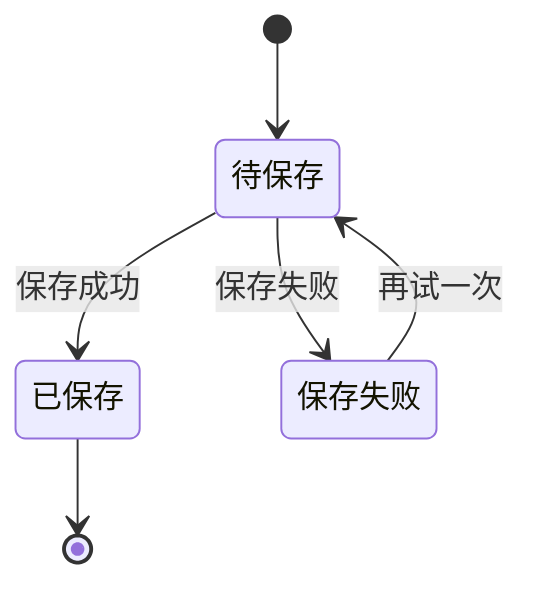
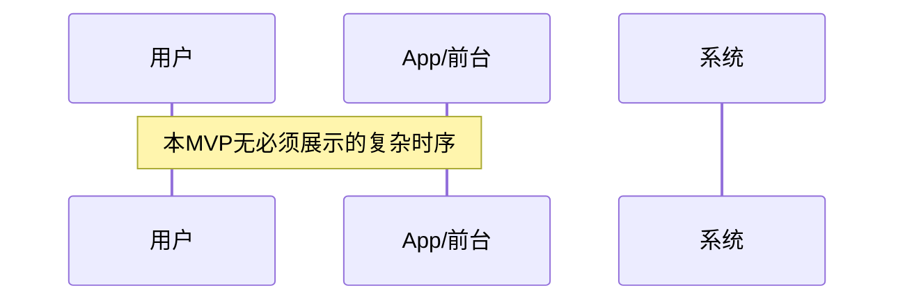

# 产品需求文档：不失（MVP） - V0.1

## 1. 综述 (Overview)
### 1.1 项目背景与核心问题
这是一个只服务“我自己”的私密空间，目标不是记录更多，而是让“当时那个版本的我”被留住，并在未来被温柔唤起。核心问题是：洞察与情绪出现得太快、记录成本太高、现有工具让真实消失；而在需要回顾时又一片空白。MVP 要解决的是“在任何状态下都能留下真实自己，并在合适时刻被温柔唤起”。

### 1.2 核心业务流程 / 用户旅程地图
1.  **阶段一：进入与放下** - 打开即记录、允许不完整、先抓住当下。
2.  **阶段二：存放与私密** - 默认私密、登录访问、无社交压力。
3.  **阶段三：被动回顾** - 轻轻出现一条过去的自己，可手动换一条。
4.  **阶段四：时间视角/轻量对齐** - 通过时间段与轻量提示对齐最近状态。
5.  **阶段五：检索兜底** - 仅在明确要找某条时检索。

### 1.3 Mermaid 图（流程/状态/时序）
> 说明：Mermaid 图用于“需求对齐”，避免歧义；避免写成技术实现细节（不要写 API 路径、字段、HTTP code、框架/库）。

#### 1.3.1 用户操作流（必填）
```mermaid
flowchart TD
  A[打开私密空间] --> B{已登录?}
  B -->|否| C[登录]
  C --> D[进入记录输入区]
  B -->|是| D[进入记录输入区]
  D --> E{此刻有想法/情绪吗}
  E -->|有| F[立即放下内容<br/>文字/图片/视频/情绪标签(可空)]
  F --> G[保存]
  G --> H[进入“存放状态”]
  E -->|没有| I[进入“被动回顾”]
  H --> I
  I --> J{内容合适吗}
  J -->|合适| K[停留/阅读]
  J -->|不合适| L[再遇见一条]
  L --> I
  I --> M{需要时间视角吗}
  M -->|是| N[粗时间段聚合查看]
  M -->|否| O[返回首页]
  O --> P{有明确要找的内容吗}
  P -->|是| Q[关键词/时间检索]
  P -->|否| R[结束/退出]
```

#### 1.3.2 状态机（当存在明确状态流转对象时必填）


#### 1.3.3 关键场景时序（仅当“时序/并发/重试/超时”影响用户可见结果时填写）


## 2. 用户故事详述 (User Stories)

### 阶段一：进入与放下

---

#### **US-01: 作为我，我希望能立刻放下一个“当下切片”，以便于不丢失瞬间洞察**
*   **价值陈述 (Value Statement)**:
    *   **作为** 自用用户
    *   **我希望** 打开即能记录，不必整理
    *   **以便于** 抓住稍纵即逝的真实
*   **业务规则与逻辑 (Business Logic)**:
    1.  **前置条件**: 用户已登录并进入记录输入区。
    2.  **操作流程 (Happy Path)**:
        - 用户输入文字/添加图片或视频/选择情绪标签（最多一个、可空）。
        - 点击“保存这一刻”。
        - 系统保存成功，输入区清空，停留在输入区。
        - 新记录立即出现在“这些时刻”列表顶部。
    3.  **异常处理 (Error Handling)**:
        - 当记录内容为空（无文字、无媒体、无情绪标签）时，不允许保存，提示：“先留下一点点，再继续也可以。”
        - 保存失败时提示：“这条暂时没留住，我们等一下再试。”
*   **验收标准 (Acceptance Criteria)**:
    *   **场景1: 成功保存**
        *   **GIVEN** 用户已登录并位于输入区
        *   **WHEN** 输入至少一种内容并点击保存
        *   **THEN** 系统保存成功、清空输入、停留在输入区，并在列表顶部展示新记录
    *   **场景2: 空内容点击保存**
        *   **GIVEN** 输入区无任何内容
        *   **WHEN** 点击保存
        *   **THEN** 提示“先留下一点点，再继续也可以。”
    *   **场景3: 保存失败**
        *   **GIVEN** 用户已输入内容
        *   **WHEN** 保存失败
        *   **THEN** 提示“这条暂时没留住，我们等一下再试。”
---
*   **页面布局线框图 (ASCII Wireframe)**:
    ```text
    +------------------------------------------------------+
    | 顶部：私密空间标题 / 品牌                            |
    +------------------------------------------------------+
    | [输入区标题]                                         |
    | [输入区说明]                                         |
    | +--------------------------------------------------+ |
    | | 输入框：两行提示（同进同出）                      | |
    | +--------------------------------------------------+ |
    | [文字] [图片] [视频] [情绪标签(可选)]  [保存这一刻]   |
    +------------------------------------------------------+
    | [这些时刻]                                           |
    | [说明文案]                                           |
    | [记录卡片…]                                         |
    +------------------------------------------------------+
    ```
---

#### **US-03: 作为我，我希望记录区的语气不评判，以便于情绪状态下也敢写**
*   **价值陈述 (Value Statement)**:
    *   **作为** 自用用户
    *   **我希望** 输入区与提示语不带引导和评价
    *   **以便于** 我愿意留下不体面的真实
*   **业务规则与逻辑 (Business Logic)**:
    1.  **前置条件**: 用户已登录并进入记录输入区。
    2.  **操作流程 (Happy Path)**:
        - 输入区提示语固定为两行，不轮换。
        - 保存按钮文案固定为“保存这一刻”。
        - 列表区说明文案使用“这里收着你最近走过的样子。”
    3.  **异常处理 (Error Handling)**:
        - 空内容保存提示固定为“先留下一点点，再继续也可以。”
*   **验收标准 (Acceptance Criteria)**:
    *   **场景1: 文案固定**
        *   **GIVEN** 用户进入记录区
        *   **WHEN** 观察输入区与按钮
        *   **THEN** 两行提示语固定、按钮文案为“保存这一刻”
    *   **场景2: 空内容提示**
        *   **GIVEN** 输入为空
        *   **WHEN** 点击保存
        *   **THEN** 提示“先留下一点点，再继续也可以。”
    *   **场景3: 列表说明文案**
        *   **GIVEN** 进入“这些时刻”区域
        *   **WHEN** 查看说明文字
        *   **THEN** 显示“这里收着你最近走过的样子。”
---
*   **页面布局线框图 (ASCII Wireframe)**:
    ```text
    +------------------------------------------------------+
    | [输入区标题]                                         |
    | [输入区说明]                                         |
    | +--------------------------------------------------+ |
    | | 提示语（固定两行）                                | |
    | +--------------------------------------------------+ |
    | [保存按钮：保存这一刻]                               |
    +------------------------------------------------------+
    | [这些时刻]                                           |
    | [这里收着你最近走过的样子。]                         |
    +------------------------------------------------------+
    ```
---

### 阶段二：存放与私密

---

#### **US-02: 作为我，我希望内容默认私密且需要登录，以便于放心留下真实**
*   **价值陈述 (Value Statement)**:
    *   **作为** 自用用户
    *   **我希望** 必须登录后才可使用
    *   **以便于** 内容始终处在私密且安全的状态
*   **业务规则与逻辑 (Business Logic)**:
    1.  **前置条件**: 用户使用邮箱与密码登录。
    2.  **操作流程 (Happy Path)**:
        - 用户输入账号与密码登录。
        - 登录后可新增记录、查看历史记录。
        - 记录卡片内支持文本复制、图片/视频下载保存。
    3.  **异常处理 (Error Handling)**:
        - 未登录状态下不可新增、不可查看历史。
        - 登录失败时提示：“没能登录上，我们再试一次。”
*   **验收标准 (Acceptance Criteria)**:
    *   **场景1: 登录后使用**
        *   **GIVEN** 用户完成登录
        *   **WHEN** 进入首页
        *   **THEN** 可新增记录并查看历史
    *   **场景2: 未登录**
        *   **GIVEN** 用户未登录
        *   **WHEN** 访问首页
        *   **THEN** 不能新增、不能查看历史
    *   **场景3: 复制与下载**
        *   **GIVEN** 用户查看某条记录
        *   **WHEN** 点击复制或下载
        *   **THEN** 文本可复制、图片/视频可下载保存
---
*   **页面布局线框图 (ASCII Wireframe)**:
    ```text
    +------------------------------------------------------+
    | 顶部：品牌/标题                                      |
    +------------------------------------------------------+
    | 记录输入区（同 US-01）                               |
    +------------------------------------------------------+
    | 这些时刻                                             |
    | [记录卡片]                                           |
    |  内容文本             [复制]                         |
    |  图片/视频预览         [下载]                         |
    +------------------------------------------------------+
    ```

---

### 阶段三：被动回顾

---

#### **US-04: 作为我，我希望被动看到一条过去的记录，以便于轻轻对齐自己**
*   **价值陈述 (Value Statement)**:
    *   **作为** 自用用户
    *   **我希望** 在平静时刻被动看到一条过去的记录
    *   **以便于** 被温柔唤起而不是强迫回顾
*   **业务规则与逻辑 (Business Logic)**:
    1.  **前置条件**: 用户已登录。
    2.  **操作流程 (Happy Path)**:
        - 右侧栏展示一条回顾内容，包含时间与情绪标签。
        - 提供按钮“再遇见一条”用于切换内容。
        - 提供“自动轮换”开关，默认关闭。
        - 开启后，每 30 秒自动切换一条回顾内容。
    3.  **异常处理 (Error Handling)**:
        - 无可回顾内容时显示：“现在还没有可回放的时刻。”
*   **验收标准 (Acceptance Criteria)**:
    *   **场景1: 正常回顾**
        *   **GIVEN** 用户已登录
        *   **WHEN** 进入首页
        *   **THEN** 右侧栏展示一条回顾内容（含时间与情绪标签）
    *   **场景2: 手动切换**
        *   **GIVEN** 正在展示一条回顾内容
        *   **WHEN** 点击“再遇见一条”
        *   **THEN** 展示另一条内容
    *   **场景3: 自动轮换**
        *   **GIVEN** 自动轮换已开启
        *   **WHEN** 30 秒到达
        *   **THEN** 自动切换到另一条内容
    *   **场景4: 无回顾内容**
        *   **GIVEN** 暂无可回顾记录
        *   **WHEN** 进入首页
        *   **THEN** 显示“现在还没有可回放的时刻。”
---
*   **页面布局线框图 (ASCII Wireframe)**:
    ```text
    +------------------------------+
    | 被动回顾                     |
    | [说明文字]                   |
    | [时间]  [情绪标签]            |
    | “回顾内容…”                  |
    | [再遇见一条]  [自动轮换开关]  |
    | （默认关闭）                 |
    +------------------------------+
    ```

---

### 阶段四：时间视角/轻量对齐

---

#### **US-05: 作为我，我希望按时间段回看，以便于感知变化**
*   **价值陈述 (Value Statement)**:
    *   **作为** 自用用户
    *   **我希望** 看到最近一段时间的记录集合
    *   **以便于** 感知我不是原地打转
*   **业务规则与逻辑 (Business Logic)**:
    1.  **前置条件**: 用户已登录。
    2.  **操作流程 (Happy Path)**:
        - 右侧栏提供固定时间段：最近 7 天 / 最近 30 天 / 最近 90 天。
        - 点击某时间段进入该时间段记录列表。
        - 列表中显示情绪标签。
    3.  **异常处理 (Error Handling)**:
        - 某时间段无记录时提示：“这段时间还没有留下记录。”
*   **验收标准 (Acceptance Criteria)**:
    *   **场景1: 时间段入口**
        *   **GIVEN** 用户在首页
        *   **WHEN** 查看右侧栏
        *   **THEN** 显示三个固定时间段入口
    *   **场景2: 进入时间段列表**
        *   **GIVEN** 用户点击某时间段
        *   **WHEN** 进入该时间段页面
        *   **THEN** 展示记录列表并显示情绪标签
---
*   **页面布局线框图 (ASCII Wireframe)**:
    ```text
    +------------------------------+
    | 粗时间视角                   |
    | [最近 7 天]   [12 条]         |
    | [最近 30 天]  [46 条]         |
    | [最近 90 天]  [108 条]        |
    +------------------------------+

    +------------------------------------------------------+
    | 时间段标题：最近 30 天                               |
    | [返回]                                               |
    | [记录卡片] 时间/情绪标签/内容                         |
    | [记录卡片] 时间/情绪标签/内容                         |
    +------------------------------------------------------+
    ```

---

#### **US-06: 作为我，我希望看到一句轻量提示，以便于对齐最近状态**
*   **价值陈述 (Value Statement)**:
    *   **作为** 自用用户
    *   **我希望** 看到一句系统生成的轻量提示
    *   **以便于** 用非评判方式对齐自己
*   **业务规则与逻辑 (Business Logic)**:
    1.  **前置条件**: 用户已登录。
    2.  **操作流程 (Happy Path)**:
        - 右侧栏在“粗时间视角”下方展示系统生成的总结句。
        - 每次打开页面都会显示该提示。
    3.  **异常处理 (Error Handling)**:
        - 生成失败或无足够内容时提示：“这段时间还太安静，等你留下些什么再说。”
*   **验收标准 (Acceptance Criteria)**:
    *   **场景1: 正常显示**
        *   **GIVEN** 用户进入首页
        *   **WHEN** 查看右侧栏
        *   **THEN** 显示系统生成的轻量提示
---
*   **页面布局线框图 (ASCII Wireframe)**:
    ```text
    +------------------------------+
    | 轻量自我观察提示             |
    | “你最近更常写下边界与被理解。” |
    +------------------------------+
    ```

---

### 阶段五：检索兜底

---

#### **US-07: 作为我，我希望检索历史记录，以便于找到明确想找的内容**
*   **价值陈述 (Value Statement)**:
    *   **作为** 自用用户
    *   **我希望** 用关键词与时间范围检索
    *   **以便于** 找到特定记录
*   **业务规则与逻辑 (Business Logic)**:
    1.  **前置条件**: 用户已登录。
    2.  **操作流程 (Happy Path)**:
        - 右侧栏输入关键词 + 时间范围。
        - 点击搜索，主区域显示“检索结果”列表（同记录卡片样式）。
        - 提供“清空检索”按钮恢复默认状态。
    3.  **异常处理 (Error Handling)**:
        - 无结果时提示：“没有找到对应的时刻。”
*   **验收标准 (Acceptance Criteria)**:
    *   **场景1: 有结果**
        *   **GIVEN** 用户输入关键词/时间范围
        *   **WHEN** 点击搜索
        *   **THEN** 主区域显示“检索结果”与记录卡片列表
    *   **场景2: 无结果**
        *   **GIVEN** 搜索条件无匹配记录
        *   **WHEN** 执行搜索
        *   **THEN** 显示“没有找到对应的时刻。”
    *   **场景3: 清空检索**
        *   **GIVEN** 当前处于检索结果页
        *   **WHEN** 点击“清空检索”
        *   **THEN** 恢复默认列表展示
---
*   **页面布局线框图 (ASCII Wireframe)**:
    ```text
    +------------------------------+
    | 基础检索                     |
    | [关键词输入]                 |
    | [开始日期] [结束日期]        |
    | [搜索]   [清空检索]           |
    +------------------------------+

    +------------------------------------------------------+
    | 检索结果                                             |
    | [记录卡片] 时间/情绪标签/内容                         |
    | [记录卡片] 时间/情绪标签/内容                         |
    +------------------------------------------------------+

    （无结果）
    没有找到对应的时刻。
    ```
---
